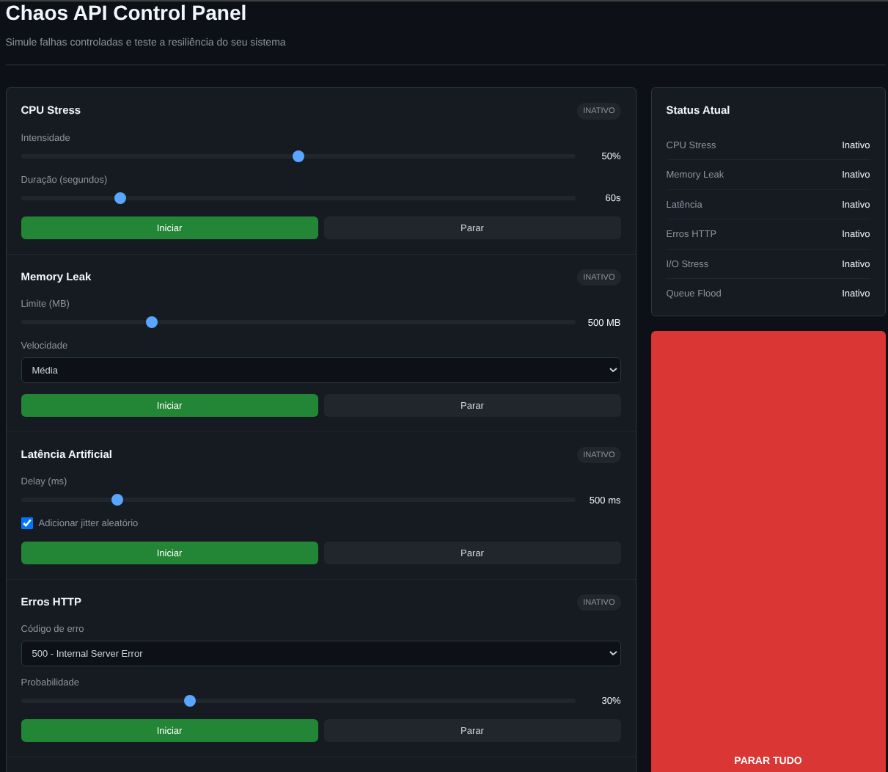

## Projeto para simular falhas controladas para testes de resiliencia.

-  Inclui API em fastAPI e interface web em HTML, CSS e JS.

/backend
uvicorn main:app --reload
http://127.0.0.1:8000
ou docker run --rm -p 8000:8000 rickdevops/chaos-api:latest

